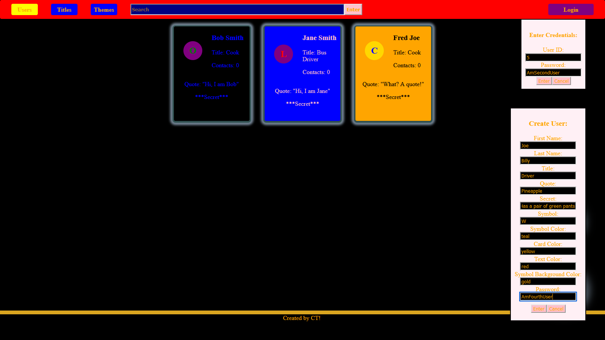
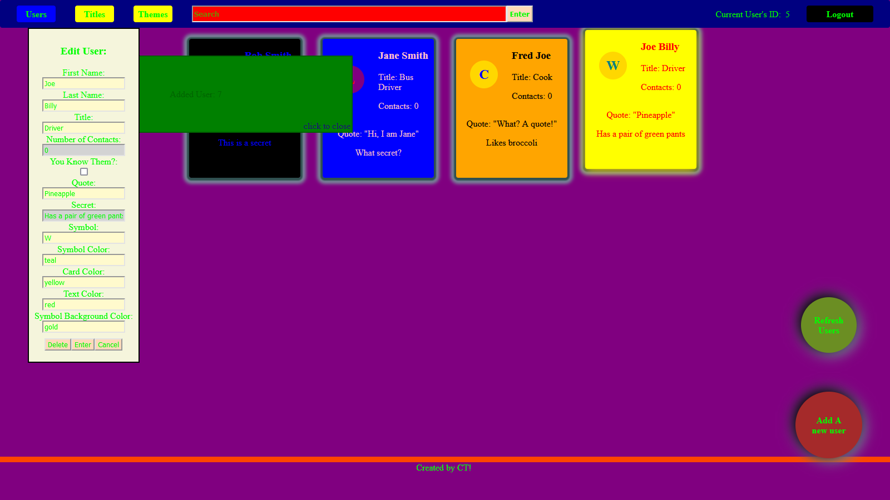
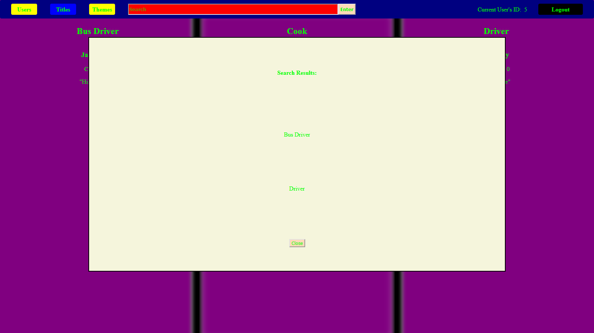
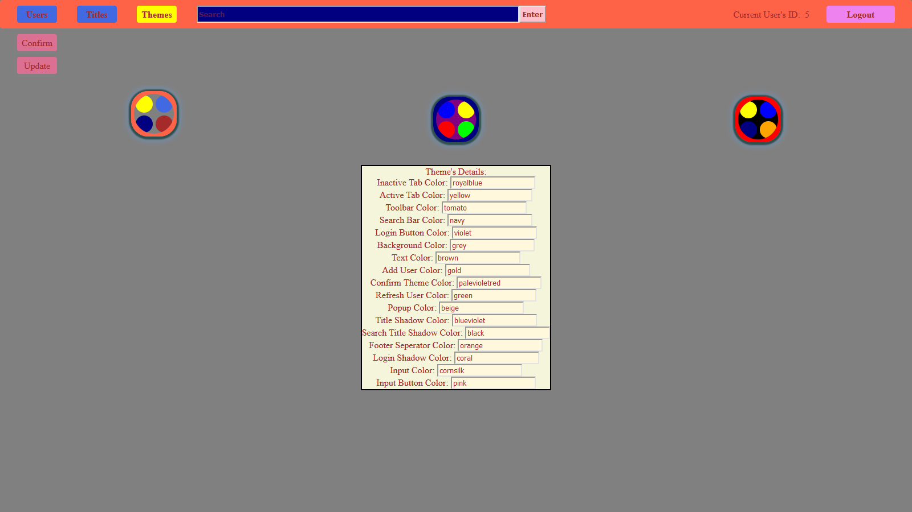

# Portfolio-Frontend
The frontend implementation for a full stack portfolio piece for CT

## Features

Add new users

Edit users

Search titles

Change themes

### Core Features
- Create an account and customize your user card
- Login and edit your user card
- View and edit your own secret information
- Select and save your theme
- Browse other user's cards
- Browse groups of users by title
- View their information
- Search and filter users by query
- Delete your own account
### Admin Features
- Login and view other user's secret information
  - Admins cannot edit other user's secret information
  - They can only edit their own secret information
- Delete any users, including yourself
- Modify themes
  - Changes to themes affect all users of the site!
## Class Design
### View Layer
/users - Users HTML Component

- Constructs and displays user cards
- Responsible for receiving creation events for edit and add user popups
- Responsible for generating the events related to adding, editing, deleting, and refreshing users

/titles - Titles HTML Component

- Displays user columns
- Displays search results
- Responsible for generating the events related to switching "pages" to different titles

/themes - Themes HTML Component

- Constructs and displays site theme representations
- Displays the selected theme's values
- Responsible for generating events related to selecting, confirming, and updating themes

toolbar - Toolbar HTML Component

- Displays tabs to naviagte the site
- Displays the response info box
- Display's the currently logged-in user's id
- Display's the search bar
- Responsible for generating the search events
- Displays the login and logout buttons
- Responsible for creating the login form, and generating login events
### Model Layer
/users - Users TypeScript Component

- Responsible for holding the information about displayed users
- Responsible for applying CSS to the /users HTML
- Responsible for generating the event triggers for the edit and add user popups and filling them out
- Responsible for handling events for the adding, editing, deleting, and refreshing of users
- Responsible for receiving information of filtered users sent from search
- Responsible for passing requests for the changing of users to the service layer

/titles - Titles TypeScript Component

- Responsible for holding the information about displayed titles and user collections
- Responsible for applying CSS to the /titles HTML
- Responsible for generating requests to be passed to the backend for the getting of titles
- Responsible for receiving titles and their users from the service layer and the receiving of filtered titles sent from the search service
- Responsible for handling events for the switching of title "pages"

/themes - Themes TypeScript Component

- Responsible for holding the information about displayed themes
- Responsible for applying CSS to the /themes HTML
- Responsible for handling events related to selecting, confirming, and updating themes
- Responsible for selecting and sending the selected theme information to the theme's details form
- Responsible for reciving site themes from, and passing the user's theme and update theme requests to the service layer

toolbar - Toolbar TypeScript Component

- Responsible for applying CSS to the toolbar
- Responsible for handling the content and status of the response info box
- Responsible for handling, parsing, and passing search events to the service layer
- Responsible for holding the login form information
- Responsible for handling, packaging, and passing login and logout requestsn to the service layer
### Controller Layer - (Service Layer)
User Service

- Responsible for facilitating communication between the users model/component layer and the web access layer

Titles Service

- Responsible for facilitating communication between the titles model/component layer and the web access layer

Themes Service - Service for managing and applying themes across the site

- Responsible for keeping track of the current and all themes
- Responsible for generating requests to get themes to the web access layer
- Responsible for applying the colors from the current theme to the CSS across the site
- Responsible for passing user's theme and update theme requests to the web access layer
- Responsible for reciving the logged in user's theme from the Login Service

Login Service - Service for managing login and logout requests and keeping track of current logged-in user

- Responsible for processing and forwarding login and logout requests
- Responsible for keeping track of the current user
- Responsible for updating the login form information
- Responsible for generating the event for the display of the response info box

Search Service - Service for handling search events and forwarding search results

- Responsible for reciving search requests and passing them to the web access layer
- Responsible for passing search result to all subscribers of a search type
### Web (Data) Access Layer
Web Service - Service for all REST requests to the backend

- Responsible for sending, and reciving to the backend and passing the HTTP response back up the layers

## Technologies
Angular (Frontend TypeScript Framework)

TypeScript/JavaScript

HTML and CSS

Jasmine (Testing Framework)

Jackson (JSON)

REST

Java (Backend)

Spring MVC (Backend Framework), Security (Authentication), and Testing (Spring's Testing Framework) (Backend)

JUnit (Testing Framework) (Backend)

JPA/HIbernate (No-SQL) (Backend)

JDBC/SQL and PostgreSQL (Backend)

## Testing with Jasmine and JUnit
Manual Testing

- Application Tests
  - Procedure for checking that the components of the site fills out correctly
    - Procedure for checking that Toolbar has loaded correctly
    - Procedure for checking that each of the components in the main section loads correctly
  - Procedure for checking displayed objects' integrities and construction
  - Procedure for checking the functionality and display of different popups and forms
  - Procedure for checking the functionality and state changes from buttons and other event sources on each of the three pages of the site
  - Procedure for checking data transfer to the backend and data permanence
  - Procedure for checking proper state and display change to the site upon change in login status
  - Procedure for verifying login and display logic
  - Procedure for verifying user privacy
  - Procedure for verifying user permissions by role
    - Procedure for individual user permissions towards their own profile
    - Procedure for verifying admin privileges

Intergration Testing

- Frontend Jasmine Tests
  - Automatically tests for proper interactions and side effects between different components and services and their state
  - Automatically tests for proper values for display triggers in the model
  - Automatically tests for the proper flow of information between the controller (service) layer and model layer
  - Automatically tests for the proper flow of information within the controller (service) layer
  - Automatically tests for proper placement of data and objects upon reception of them from the backend
  - Automatically tests event handlers for proper state change and backend requests
  - Automatically checks for the flow of login information and current user state between different components and services
- Backend JUnit Tests
  - Automatically tests input validation
  - Automatically tests information filtering
  - Automatically tests information access by account and role
  - Automatically tests for data integrity
  - Automatically tests API request and response data formats

Made By CT!

See the Backend at [github.com/AnInvertedFern/BackEndPortfolio](https://github.com/AnInvertedFern/BackEndPortfolio)!

## User Login Information *
"Bob Smith" - User ID : 4, Password : AmFirstUser, Role : User

"Jane Smith" - User ID : 5, Password : AmSecondUser, Role : Admin

"Fred Joe" - User ID : 7, Password : AmThirdUser, Role : User

\* User IDs are auto generated and system dependent, check the backend console or database to confirm for your system